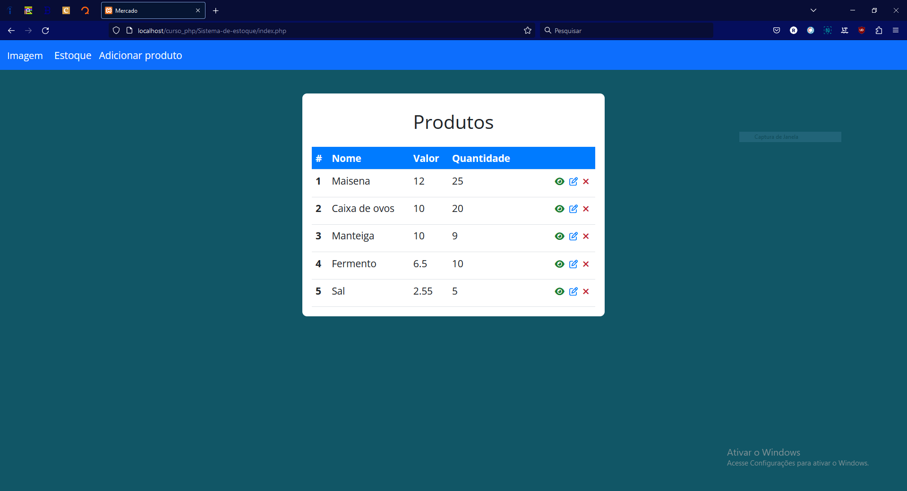
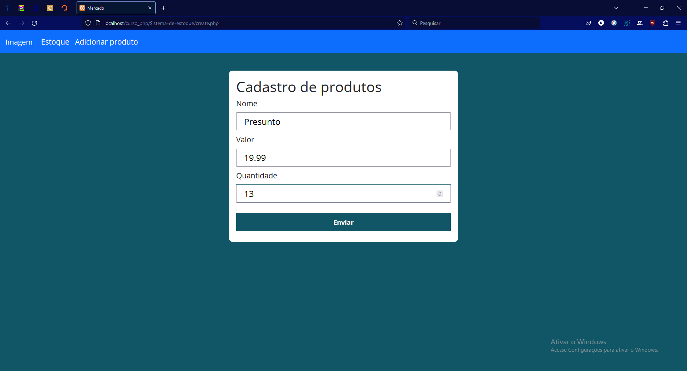
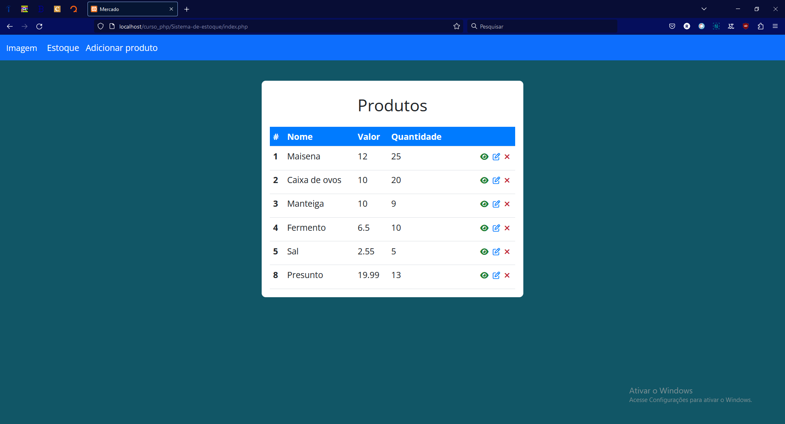
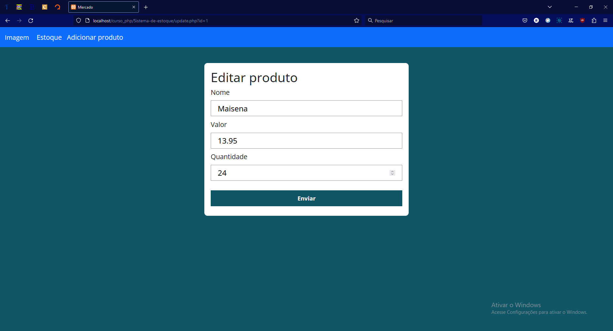
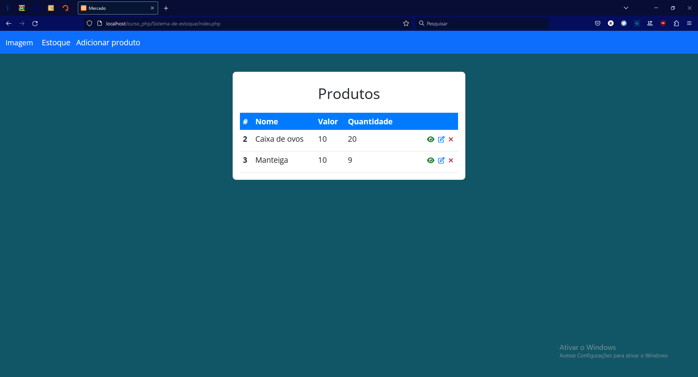

# Projeto (PHP) - Sistema de  estoque Pt.1

Projeto de sistema de estoque para um mercado (foco no backend) :)

## Tabela de conteudos

- [Overview](#overview)
  - [Descrição](#Descrição)
  - [Screenshot](#screenshot)
- [Author](#author)

## Overview

### Descrição

Esta é primeira parte de um projeto que estou desenvolvendo por vontade propria, um sistema de gerenciamento de estoque.
Trata-se de um sistema comum, esta primeira parte é o CRUD principal de uma tabela sem relacionamento algum. O que pretendo mudar nas proximas adições, deixando-o mais completo e robusto.

Pretendo adicionar mais tabelas e relacionamentos, através do banco de dados MySql e com o backend feito com a linguagem PHP.

Conforme irei trabalhando no projeto, também pretendo estender este LEIAME, mas por enquanto é isto.

### Screenshot

## Author
- Linkedin - [Ruan Pereira](https://www.linkedin.com/in/ruan-pereira-651523237/)
